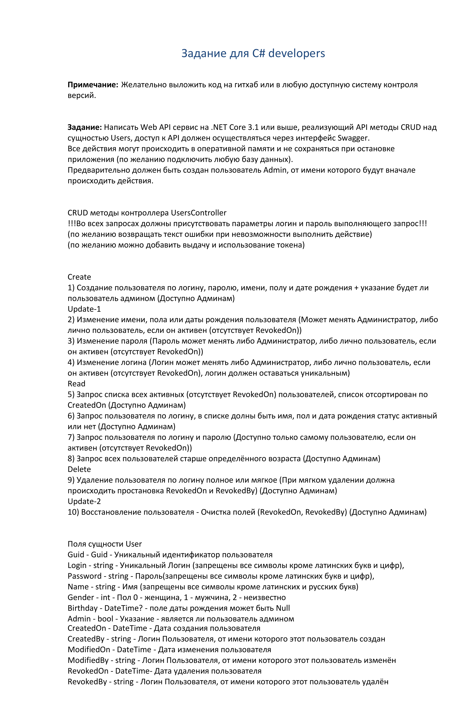

<p>
    <h1 align="center">UserApiTestTask</h1>
</p>

<p align="center">
    Web API для тестового задания на ASP.NET
</p>

<p align="center">
  
  
  
  
  
  
  
  
</p>

<div align="center">
    <a href="https://github.com/Skye7012/UserApiTestTask/issues">
        
    </a>
    <a href="https://github.com/Skye7012/UserApiTestTask/issues?q=is%3Aissue+is%3Aclosed">
        
    </a>
</div>


# Table Of Contents

- [Table Of Contents](#table-of-contents)
- [ТЗ](#тз)
- [Общее описание](#общее-описание)
- [Уточнения по реализации:](#уточнения-по-реализации)
    - [Авторизация](#авторизация)
    - [Поле `user_password` сущности `user`](#поле-user_password-сущности-user)
    - [Первый Admin](#первый-admin)
    - [Метаданные создания, обновления и удаления](#метаданные-создания-обновления-и-удаления)
    - [Эндпоинты](#эндпоинты)
- [Локальный запуск](#локальный-запуск)
    - [Учетные данные пользователя-администратора:](#учетные-данные-пользователя-администратора)


# ТЗ



# Общее описание

**Задание реализовано с уточнениями, описанными ниже**  

Реализован API на ASP.NET 6  

Реализована поддержка docker-compose [(см. "Локальный запуск")](#локальный-запуск)  

API задокументирован с помощью `Swagger`  
Проект структурирован по принципам `clean architecture`  
Используется `CQRS` через [`MediatR`](https://github.com/jbogard/MediatR)  
В качестве ORM используется `Entity Framework Core`, в качестве СУБД `PostgreSql`  
Аутентификация реализована через [`JWT`](https://jwt.io/) токены  
Используется `Redis` для хэширования
  
Написаны модульные тесты с помощью `xUnit` и [`FluentAssertions`](https://github.com/fluentassertions/fluentassertions)  


# Уточнения по реализации:
###  Авторизация  
- Авторизация реализована через JWT токены
- Методы связанные с авторизацией перенесены в AuthorizationController, а именно регистрация, аутентификация, обновление токенов и завершение сессий
- \+ Изменение логина и пароля, потому что была выделена отдельная сущность `UserAccount` (`Аккаунт пользователя`), которая содержит данные для авторизации

###  Поле `user_password` сущности `user`  
- В сущности `user` столбец `user_password` был перенесен в `user_account` и разделён следующим образом: `user_account_passwordHash` и `user_account_passwordSalt`. Сделано это для того, чтобы хранить пароли в БД в захэшированном виде  
  
### Первый Admin
- Самый первый админ в БД создается с логином = `Admin`, а пароль его конфигурируется ([см. DbInitExecutor.cs](src/UserApiTestTask.Infrastructure/InitExecutors/DbInitExecutor.cs))  
- Дефолтный пароль "`AdminPassword`"  
  **Значение в docker-compose = "Admin"** [(см. Учетные данные администратора)](#Учетные-данные-пользователя-администратора)

### Метаданные создания, обновления и удаления
- Метаданные создания, обновления есть у всех сущностей, а метаданные удаления у сущностей поддерживающих мягкое удаление  
- Так как в JWT Токене для валидности данных используются клеймы `user_id` и `user_account_id`. Было принято решение использовать `Redis` для хэширования `логина` по `user_account_id` для заполнения полей `created_by`, `modified_by`, `revoked_by`
- Однако все равно возникает проблема из-за метода изменение логина: в данном сценарии при изменении логина придется во всех сущностях искать и менять поля метаданных `..._by` на новый логин. Это сложная операция и тут появляется проблема, которую нужно решить либо убиранием метода смены логина, либо сменой значений полей `..._by` на `user_account_id`, а не `login`. Несмотря на сильные отклонения от ТЗ, этот момент я уже решил не менять и оставить как есть

### Эндпоинты
- Создание пользователя — "`/Authorization/SignUp`"
- 6 и 7 эндпоинты по получению данных о пользователя были реализованы в одном эндпоинте из-за JWT авторизации  


# Локальный запуск
- `git clone https://github.com/Skye7012/UserApiTestTask.git`

- `cd UserApiTestTask`

- `docker-compose build`

- `docker-compose up`

- **Swagger**: [http://localhost:5000/swagger/index.html](http://localhost:5000/swagger/index.html)

### Учетные данные пользователя-администратора:

```json
{
  "login": "Admin",
  "password": "Admin"
}
```
  
  
Volumes для БД будет создан на уровень выше корневой директории
